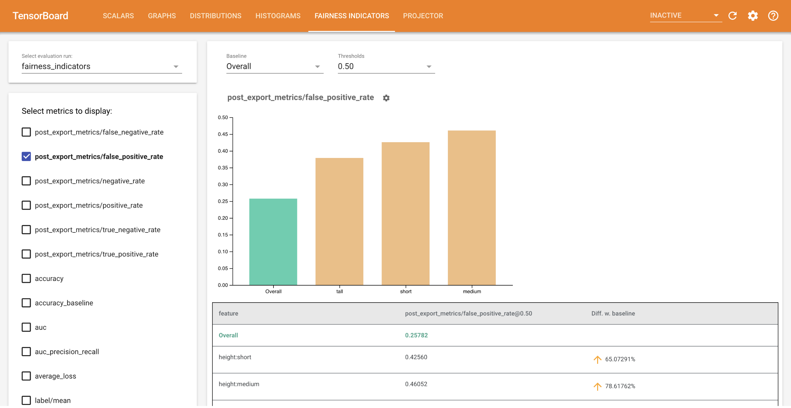

# Evaluating Models with the Fairness Indicators Dashboard [Beta]

Fairness Indicators for TensorBoard enables easy computation of commonly-identified fairness metrics for _binary_ and _multiclass_ classifiers. With the plugin, you can visualize fairness evaluations for your runs and easily compare performance across groups. 

In particular, Fairness Indicators for TensorBoard includes the ability to:
* Evaluate the distribution of datasets
* Evaluate model performance, sliced across defined groups of users. Feel confident about your results with confidence intervals and evaluations at multiple thresholds 

Many existing tools for evaluating fairness concerns don’t work well on large scale datasets and models. At Google, it is important for us to have tools that can work on billion-user systems. Fairness Indicators will allow you to evaluate across any size of use case, in the Tensorboard environment or in [Colab](https://github.com/tensorflow/fairness-indicators). 

## Requirements

To install Fairness Indicators for Tensorboard, run:

`pip install tensorflow_plugin_fairness_indicators`

`pip uninstall -y tensorflow tf-nightly`

`pip install tensorflow` (1.15+)

`pip install tensorflow_model_analysis` (0.15.1+)

`pip uninstall -y tensorboard tb-nightly`

`pip install tf-nightly` (2.1+)

## Demo

If you want to test out Fairness Indicators in TensorBoard, you can download sample TensorFlow Model Analysis evaluation results (eval_config, metrics and plots files) and a `demo.py` utility from Google Cloud Platform, [here](https://console.cloud.google.com/storage/browser/tensorboard_plugin_fairness_indicators/). This evaluation data is based on the [Civil Comments dataset](https://www.kaggle.com/c/jigsaw-unintended-bias-in-toxicity-classification), calculated using the [tensorflow_model_analysis.ExtractEvaluateAndWriteResult](https://github.com/tensorflow/model-analysis/blob/master/tensorflow_model_analysis/api/model_eval_lib.py) API. It also contains a sample TensorBoard summary data file for reference. See the [TensorBoard tutorial](https://github.com/tensorflow/tensorboard/blob/master/README.md) for more information on summary data files.

The `demo.py` utility writes a TensorBoard summary data file, which will be read by TensorBoard to render the Fairness Indicators dashboard. Flags to be used with the `demo.py` utility: 

* `--logdir`:  Directory where TensorBoard will write the summary
* `--eval_result_output_dir`: Directory containing evaluation results evaluated by TFMA (downloaded in last step)

Run the `demo.py` utility to write the summary results in the log directory:

`python demo.py --logdir=<logdir>/demo --eval_result_output_dir=<eval_result_dir>`

Run TensorBoard:

`tensorboard --logdir=<logdir>`

This will start a local instance (link will be provided once the local instance is started), open the link in your browser to view the Fairness Indicators dashboard. 

## Usage

To use the Fairness Indicators with your own data and evaluations:

1. Train a new model and evaluate using [tensorflow_model_analysis.ExtractEvaluateAndWriteResult](https://github.com/tensorflow/model-analysis/blob/master/tensorflow_model_analysis/api/model_eval_lib.py) API. For code snippets on how to do this, see the Fairness Indicators colab [here](https://github.com/tensorflow/fairness-indicators). 

2. Run the `demo.py` file (download [here](https://console.cloud.google.com/storage/browser/tensorboard_plugin_fairness_indicators/demo))
    * Set `--logdir=<logdir>/testing_tensorboard`
    * Set `--eval_result_output_dir` flag value to the directory containing your model’s evaluation result.
  
3. Run TensorBoard
    * `tensorboard --logdir=<logdir>`
    * Select the new evaluation run using the drop-down on the left side of the dashboard to visualize results.
